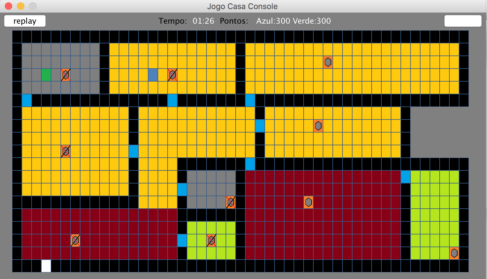

# GameCasaSwing
Pequeno Game Java Desktop controlado por teclado

Desenvolvido usando Swing para interface grafica. Desenvolvemos cenários de jogo desenhados em classe de painel customizada.
Carregamos os cenarios do jogo a partir de arquivos texto com caracteres padrão representando elementos do jogo.
O Objetivo do sistema é trabalhar conceitos como uso de Threads, Acesso a arquivo, Streams, Arquitetura em Camadas, 
Enumerados, Eventos entre outros abordados durante o curso de Java que tenho ministrado em algumas instituições de ensino. 

